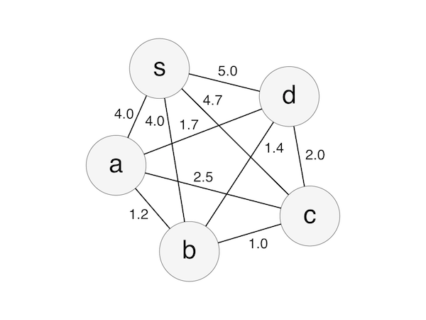
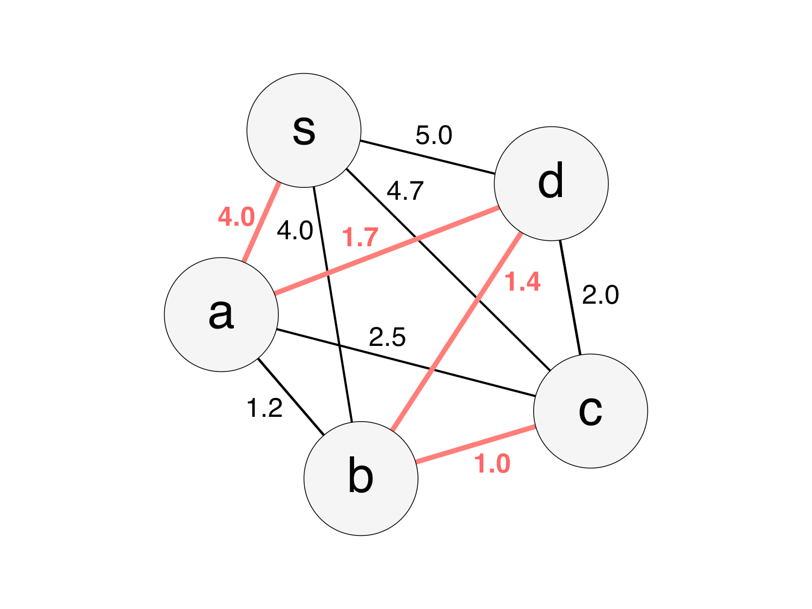

Ant Colony
---
Ant colony optimization is a probabilistic solution
to solve like the shortest path problem,
imitates the ant behavior in finding a route to food.

Please see here for details of the algorithm.

[Ant Colony Optimization](http://www.aco-metaheuristic.org/index.html)

## Description
In this program, we can find an approximate solution of the shortest path problem as follows.



- Start from s and go through all nodes
- The number on the path represents the distance between the nodes

In this example, when passing in the order of a, d, b, c, the distance becomes the shortest 8.1.



## Usage
Usage is as follows.

```js
const AntColony = require('./ant-colony');
const NOA = 10;
const LIMIT = 100;
const Q = 3;
const RHO = 0.8;
const EPSILON = 0.15;
const distance = [
  //  s    a    b    c    d
  [ 0.0, 4.0, 4.0, 4.7, 5.0 ], // start
  [ 0.0, 0.0, 1.2, 2.5, 1.7 ], // a
  [ 0.0, 1.2, 0.0, 1.0, 1.4 ], // b
  [ 0.0, 2.5, 1.0, 0.0, 2.0 ], // c
  [ 0.0, 1.7, 1.4, 2.0, 0.0 ]  // d
];
const ac = new AntColony(NOA, LIMIT, Q, RHO, EPSILON, distance);

ac.solve();
console.log(ac.result());
```

|Variable|Meaning|
|---|---|
|NOA|Number of ants|
|LIMIT|Maximum number of attempts|
|Q|Influence of pheromone|
|RHO|Evaporation rate of pheromone|
|EPSILON|The probability of not considering the pheromone concentration when an ant chooses the next node (epsilon-greedy method)|
|distance|Two-dimensional array of graph|
